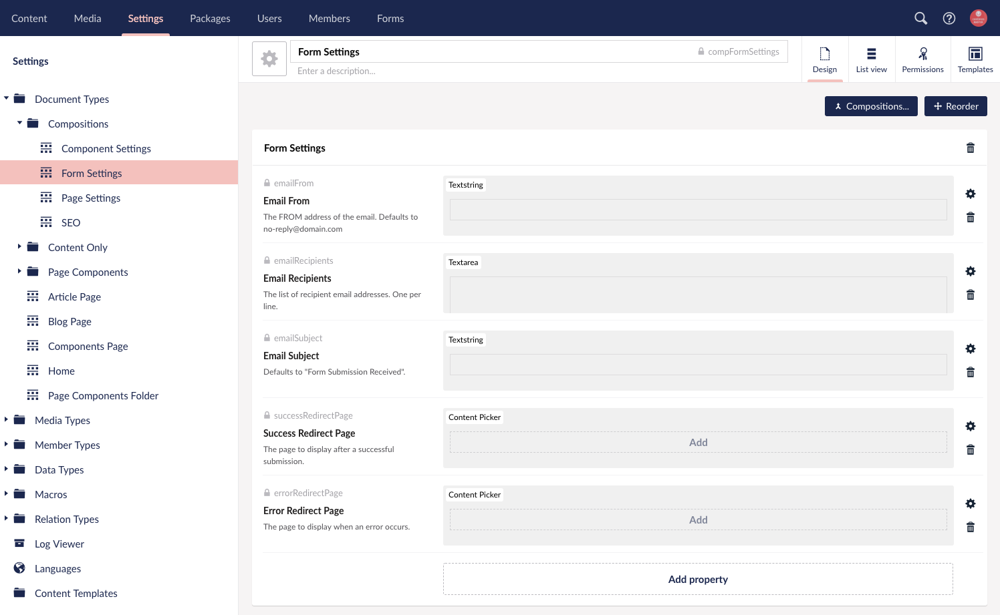
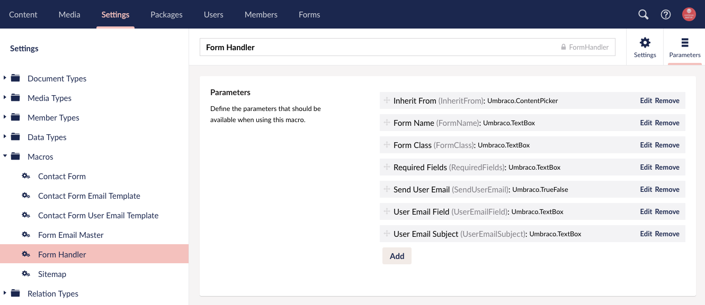

## Table of Contents
{: .no_toc .text-delta }

1. TOC
{:toc}

---

# How It Works
{: .no_toc }

Before the form handler will render a form on the page. It will check for email recipients. If no email recipients are defined, it will assume the form is not being used.

Basic **Form Settings** are set by the content editor within Umbraco including: 

- Email From
- Email Recipients
- Email Subject
- Success Redirect Page
- Error Redirect Page

These settings are on the Form Settings document type composition included in the starterkit package.

Macro parameters for the form handler must be setup by a developer. These are the **Developer Settings**:

- Inherit From
- Form Name
- Form Class
- Required Fields
- Send User Email
- User Email Field
- User Email Subject

## Form Settings Explained

The Form Settings Document Type (aka doctype) is setup in the Compositions organizational folder. This doctype acts as composition for various nodes that require form settings. Using this method insures that all doctypes that need the form settings will have the same settings applied.

#### Important Note About Doctype Naming Conventions
{: .no_toc }

The naming convention for composition doctypes are prefixed with `comp` and then the doctype name in a camel case format. For example, the Form Settings doctype alias is `compFormSettings`. Compositions also use the `icon-settings` in black for the doctype icon. This practice makes it easy to recognize when selecting doctypes within Umbraco. [Read more](/MyUmbDocs/Starterkit-Package/Package-Includes.html#important-document-type-naming-conventions) about the naming convention used in projects here.

### Document Type Properties:

| Title | Alias | Property Type | Description |
|-------|-------|---------------|-------------|
| Email From | emailFrom | textstring | The from address of an email. This will default to no-reply@domain.com |
| Email Recipients | emailRecipients | textarea | The list of email recipients the form sends too. One per line. If this is empty, the form handler will assume the form is not in use and not load on the page. |
| Email Subject | emailSubject | textstring | The email subject of the form. This defaults to "Form Submission Received" |
| Success Redirect Page | successRedirectPage | Content Picker | The page to display after a successful submission. |
| Error Redirect Page | errorRedirectPage | Content Picker | The page to display when an error occurs. |

## Developer Settings Explained

These settings are configured by a developer every time the form handler is needed. These are the basic settings telling the form handler where to get the content editor settings (if applicable), the form name, form class for styling purposes, handle server side validation with required fields and setup the user email that is received by the person who fills out the form on the front end of the website.

### Form Handler Macro Parameters:

| Title | Alias | Property Type | Description |
|-------|-------|---------------|-------------|
| Inherit From | InheritFrom | Content Picker | Defaults to the current page for form settings unless otherwise specified. Typical uses include overriding form settings on a particular page to use universal form settings or form settings from another page. |
| Form Name | FormName | textBox | Required field. This must match the macro naming conventions noted in [setting up a new form](Using-The-Form-Handler.md#setup-a-new-form). |
| Form Class | FormClass | textBox | Optional field to add a class to the form if needed for styling purposes. |
| Required Fields | RequiredFields | textBox | CSV formatting for names of required fields on the form. |
| Send User Email | SendUserEmail | trueFalse | if true, the form handler will attempt to send the user a confirmation email upon successful form submission. |
| User Email Field | UserEmailField | textBox | If sending a user email is true, the user email field will need to be definied. This value is the name of the email field that correlates to the form markup. |
| User Email Subject | UserEmailSubject | textBox | If empty, the user email subject will default to "Thank you for contacting us." |

## Form Submission Handling Explained

Once your form is filled out and submitted on a page, assuming proper validation is sucessful, the Form Handler will submit the form to the email addresses specified by the form settings.

The Form Handler takes the email template and if being used, the user email template file and loads that markup into the `{INNER_CONTENT}` tag in the Form Email Master partial view macro file. The Form Email Master contains the main `<html>` and `<body>` markup for the email that is then sent on sucessful submission. 

### Customizing The Form Handler Email

If you would like to markup your own email template that gets sent out with the form handler, you would begin by editing the master markup in the Form Email Master partial view macro file and then update the individual email template macro partial view files. 

Think of this setup similar to the way templates work with a master template and child templates loading into sections within the master template. The master template will be changes for all emails and typically include things such as the header and footer areas as well as a containing table body for the inner content. Each individual email template will then load within the same `{INNER_CONTENT}` section. 
