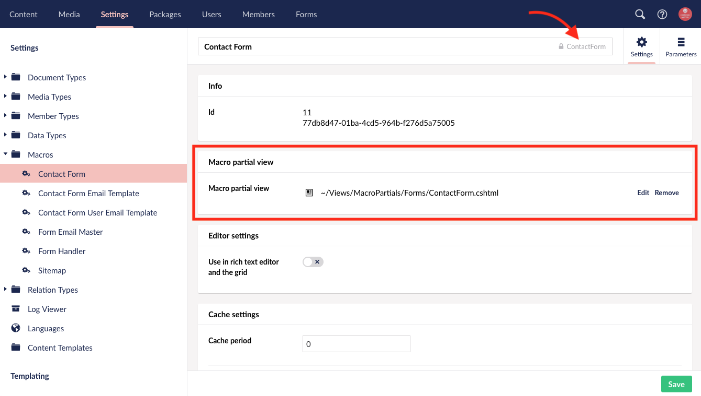

# DT Form Handler Package

The form handler is a single Umbraco macro that handles form submissions for *all forms* within an Umbraco site. Please keep this in mind if you ever need to make changes directly to the form handler itself.

The Form Handler and required files are included in the DT Starterkit Package. The files listed below are the files required by the Form Handler to handle form submissions as well as the necessary files for the default Contact Form included.

- `~/Views/MacroPartials/FormHandler.cshtml`
- `~/Views/MacroPartials/FormEmailMaster.cshtml`
- `~/Views/MacroPartials/Forms/` [*Optional Directory for Organizational Purposes*]
- `~/Views/MacroPartials/Forms/ContactForm.cshtml`
- `~/Views/MacroPartials/Forms/ContactFormEmailTemplate.cshtml`
- `~/Views/MacroPartials/Forms/ContactFormUserEmailTemplate.cshtml`

The corresponding macros are also included in the DT Starterkit Package. Each macro has an associated macro partial view on the macro settings. This is how Umbraco knows what file to render when referencing a macro. The macro aliases are also defined here and are case sensitive with no spaces or special characters. You will notice that these macro aliases correspond to the Form Name when [setting up a new form](Using-The-Form-Handler.md#setup-a-new-form).

1. Form Handler
    - Parameters: 
      - Title: `Inherit From` Alias: `InheritFrom` Type: `Textarea`
2. Form Email Master
3. Contact Form
4. Contact Form Email Template
5. Contact Form User Email Template

