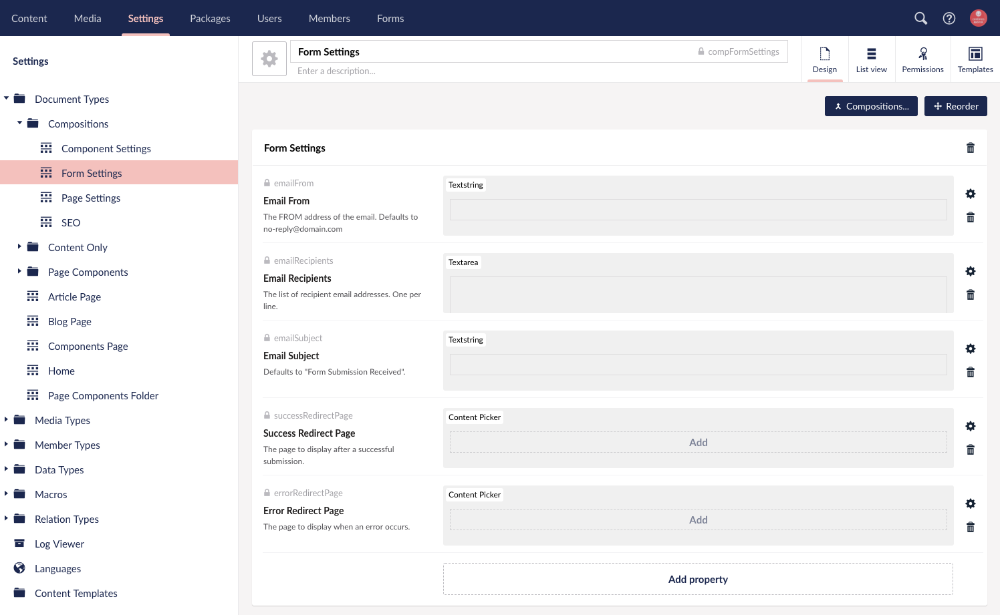

# DT Form Handler

The form handler is a single Umbraco macro that handles form submissions for *all forms* within an Umbraco site. Please keep this in mind if you ever need to make changes directly to the form handler itself.

The Form Handler and required files are included in the DT Starterkit Package. The files listed below are the files required by the Form Handler to handle form submissions as well as the necessary files for the default Contact Form included.

- /Views/MacroPartials/FormHandler.cshtml
- /Views/MacroPartials/FormEmailMaster.cshtml
- /Views/MacroPartials/Forms/ [*Optional Directory for Organizational Purposes*]
- /Views/MacroPartials/Forms/ContactForm.cshtml
- /Views/MacroPartials/Forms/ContactFormEmailTemplate.cshtml
- /Views/MacroPartials/Forms/ContactFormUserEmailTemplate.cshtml

The corresponding macros are also included in the DT Starterkit Package. Each macro has an associated macro partial view on the macro settings. This is how Umbraco knows what file to render when referencing a macro. The macro aliases are also defined here and are case sensitive with no spaces or special characters. You will notice that these macro aliases correspond to the Form Name when [setting up a new form](#setup-a-new-form).

1. Form Handler
2. Form Email Master
3. Contact Form
4. Contact Form Email Template
5. Contact Form User Email Template

# How it Works

Before the form handler will render a form on the page. It will check for email recipients. If no email recipients are defined, it will assume the form is not being used.

Basic Form Settings are set by the content editor within Umbraco including: 

- Email From
- Email Recipients
- Email Subject
- Success Redirect Page
- Error Redirect Page

These settings are on the Form Settings Composition DocumentType included in the DT Starterkit Package.

Macro Parameters on the Form Handler Macro include:

- Inherit From
- Form Name
- Form Class
- Required Fields
- Send User Email
- User Email Field
- User Email Subject

These settings are defined by a developer when setting up the form handler on a page.

Inherit From can be used to override content editor settings on a particular page to use universal settings or settings for another page for the Form Handler.

## Form Settings Explained

The Form Settings DocumentType (aka doctype) is setup in the Compositions organizational folder. This doctype acts as composition for various nodes that require form settings. Using this method insures that all doctypes that need the form settings will have the same settings applied.

**Important Note About Doctype Naming Conventions** The naming convention for composition doctypes are prefixed with "comp" and then the doctype name in a camel casing format. For example, the Form Settings doctype alias is `compFormSettings`. Compositions also use the general settings icon in black for the doctype icon. This practice makes it easy to recognize when selecting doctypes within Umbraco.

**Document Type Properties:**

- Email From, emailFrom, textstring
  - The from address of an email. This will default to no-reply@domain.com
- Email Recipients, emailRecipients, textarea
  - The list of email recipients the form sends too. One per line. If this is empty, the form handler will assume the form is not in use and not load on the page.
- Email Subject, emailSubject, textstring
  - The email subject of the form. This defaults to "Form Submission Received"
- Success Redirect Page, successRedirectPage, Content Picker
  - The page to display after a successful submission.
- Error Redirect Page, errorRedirectPage, Content Picker
  - The page to display when an error occurs.

## Developer Settings Explained

These settings are configured by a developer every time the form handler is needed. These are the basic settings telling the form handler where to get the content editor settings (if applicable), the form name, form class for styling purposes, handle server side validation with required fields and setup the user email that is received by the person who fills out the form on the front end of the website.

**Form Handler Macro Parameters:**

- Inherit From, InheritFrom, Content Picker
  - Defaults to the current page for form settings unless otherwise specified.
- Form Name, FormName, textBox
  - Required field. This must match the macro naming conventions noted in [setting up a new form](#setup-a-new-form).
- Form Class, FormClass, textBox
  - Optional field to add a class to the form if needed for styling purposes.
- Required Fields, RequiredFields, textBox
  - CSV formatting for names of required fields on the form.
- Send User Email, SendUserEmail, trueFalse
  - if true, the form handler will attempt to send the user a confirmation email upon successful form submission.
- User Email Field, UserEmailField, textBox
  - If sending a user email is true, the user email field will need to be definied. This value is the name of the email field that correlates to the form markup.
- User Email Subject, UserEmailSubject, textBox
  - If empty, the user email subject will default to "Thank you for contacting us."

## Form Submission Handling Explained

Once your form is filled out and submitted on a page, assuming proper validation is sucessful, the Form Handler will submit the form to the email addresses specified by the form settings.

The Form Handler takes the email template and if being used, the user email template file and loads that markup into the `{INNER_CONTENT}` tag in the Form Email Master partial view macro file. The Form Email Master contains the main `<html>` and `<body>` markup for the email that is then sent on sucessful submission. 

### Customizing The Form Handler Email

If you would like to markup your own email template that gets sent out with the form handler, you would begin by editing the master markup in the Form Email Master partial view macro file and then update the individual email template macro partial view files. 

Think of this setup similar to the way templates work with a master template and child templates loading into sections within the master template. The master template will be changes for all emails and typically include things such as the header and footer areas as well as a containing table body for the inner content. Each individual email template will then load within the same `{INNER_CONTENT}` section. 

# Using the Form Handler

The process for using the form handler is listed below but please make sure to read the [setup a new form](#setup-a-new-form) section before you proceed with creating new forms using the form handler. It is important to follow the naming conventions otherwise your form will not work.

## Setup A New Form

You will need to setup 3 macros for each new form with a specific file naming convention. For example, for a "Contact Form" you would setup the following macros:

1. Contact Form
2. Contact Form *User Email Template*
3. Contact Form *Email Template*

**Important Note About Form Naming Conventions**: Each form will need to have the same name in the beginning of the file, for example, "Contact Form"; and the other two files will need to be identical with the additional words "Email Template" and "User Email Template". It is important to check your spelling here. Make sure that you are following this format, otherwise the Form Handler will not be able to find the correct form macros. **The form handler is case senstive**.

The form handler setting for `FormName` requires the main form name value. Do not insert special characters into this name. At most, you can use spacing, which the Form Handler will remove to search for macro aliases. In this example, the form name would be "Contact Form". The form handler will then search for the "Contact Form User Email Template" and "Contact Form Email Template" macros automatically. This is why the naming convention process must be followed.

### Create New Macro Partial View Form Files

**Important!** Read [setting up a new form](#setup-a-new-form) before creating new macro partial view form files.

For your new form, you will find it easiest to setup the form files within the Umbraco backoffice. This is because when you create a new macro partial view file in the backoffice, Umbraco will create the macro associated with that file as well. This saves you a step.

Navigate to the Settings section, right click on the Partial View Macro Files under the Templating section and click Create. Select New Partial View Macro. Give your macro a name and Save the new file. You will need to do this 3 times for your new form following the naming conventions specified in the [setup a new form](#setup-a-new-form) section.

### Configure Email Template

The Contact Form Email Template is plain html markup that is rendered within the `{INNER_CONTENT}` area of the Form Email Master Template. The markup you insert here will need to be compatible with email clients.

This email is what is sent to the email recipients configured on the form settings.

### Configure User Email Template

The Contact Form User Email Template is plain html markup that is rendered within the `{INNER_CONTENT}` area of the Form Email Master Template. The markup you insert here will need to be compatible with email clients.

This email is what is sent to your user who fills out your form when an email address is provided.

## Applying The Form Settings Doctype Composition

Before using the Form Handler macro, you will need to make sure that the content editor can setup the [form settings](#form-settings-explained) on a node within Umbraco.

**Please consult a developer for tips on best practice to implement this functionality prior to making these changes. This guide is for general setup instructions and implementation can vary per Umbraco site.**

If the form settings are not available on your doctype, you can apply the Form Settings doctype as a composition by navigating to the doctype in the Settings section, click on the Compositions button, tick the checkbox for Form Settings, click Submit and Save your changes.

Once you have your form settings composition applied to your doctype you will see the Form Settings area on your content node's Content App.

## Using the Form Handler Macro Directly on a Template

The Form Handler macro can be used directly on a template by navigating to the template within Umbraco, clicking Insert and selecting the Form Handler macro. 

Once you have selected the form handler, the [developer settings](#developer-settings-explained) will be available to configure in the dialog window. You must configure these settings in order for the Form Handler to work. Once configured on your template, the form handler macro will appear like this:

`@Umbraco.RenderMacro("FormHandler", new {InheritFrom="", FormName="ContactForm", FormClass="", RequiredFields="Name, Email", SendUserEmail="1", UserEmailField="Email", UserEmailSubject="Thank you for contacting us!"})`

You will also need to make sure that the content node using this template has the [Form Settings doctype composition assigned](#applying-the-form-settings-doctype-composition) to it so that the content editor can set the [form settings](#form-settings-explained).

## Using the Form Handler on a Content Node

Once you have [applied the form settings doctype composition](#applying-the-form-settings-doctype-composition) to your content node, the [form settings](#form-settings-explained) will be available to configure and you can insert the Form Handler macro onto the page. The macro can be inserted on the page in multiple ways depending on your Umbraco setup. The simplest way to insert a macro on a page is to navigate to the Rich Text Editor and use the Insert Macro icon to insert the form handler macro and configure the [developer settings](#developer-settings-explained).

Note that if your macro is configured and setup on a node that does not have the Form Settings applied, make sure you set the Inherit From setting on your Form Handler macro to the correct node containing your form settings.
