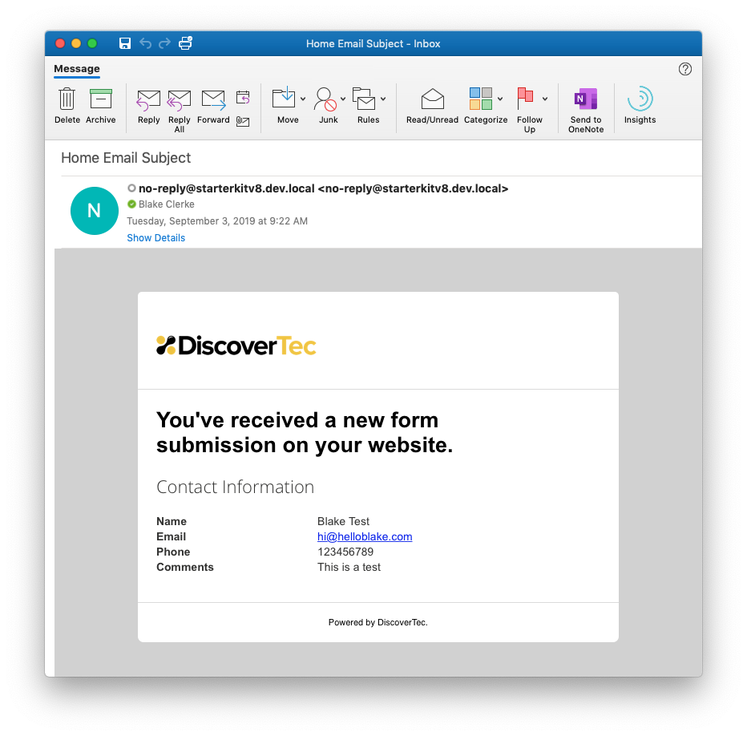
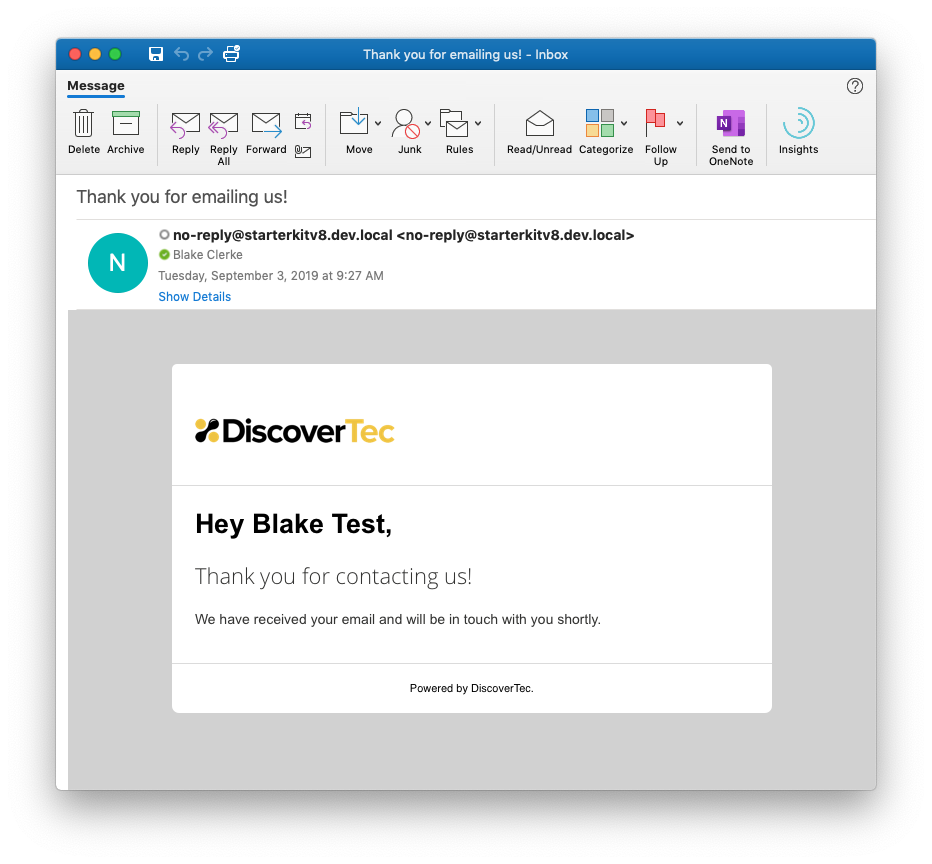

**Table of Contents**
1. TOC
{:toc}

# Using the Form Handler

The process for using the form handler is listed below but please make sure to read the [setup a new form](#setup-a-new-form) section before you proceed with creating new forms using the form handler. It is important to follow the naming conventions otherwise your form will not work.

## Setup A New Form

You will need to setup 3 macros for each new form with a specific file naming convention. For example, for a "Contact Form" you would setup the following macros:

1. Contact Form
2. Contact Form *User Email Template*
3. Contact Form *Email Template*

**Important Note About Form Naming Conventions**: Each form will need to have the same name in the beginning of the file, for example, "Contact Form"; and the other two files will need to be identical with the additional words "Email Template" and "User Email Template". It is important to check your spelling here. Make sure that you are following this format, otherwise the Form Handler will not be able to find the correct form macros. **The form handler is case senstive**.

The form handler setting for `FormName` requires the main form name value. Do not insert special characters into this name. At most, you can use spacing, which the Form Handler will remove to search for macro aliases. In this example, the form name would be "Contact Form". The form handler will then search for the "Contact Form User Email Template" and "Contact Form Email Template" macros automatically. This is why the naming convention process must be followed.

### Create New Macro Partial View Form Files

**Important!** Read [setting up a new form](#setup-a-new-form) before creating new macro partial view form files.

For your new form, you will find it easiest to setup the form files within the Umbraco backoffice. This is because when you create a new macro partial view file in the backoffice, Umbraco will create the macro associated with that file as well. This saves you a step.

Navigate to the Settings section, right click on the Partial View Macro Files under the Templating section and click Create. Select New Partial View Macro. Give your macro a name and Save the new file. You will need to do this 3 times for your new form following the naming conventions specified in the [setup a new form](#setup-a-new-form) section.

### Configure Your Form

The beauty of Umbraco lies in the fact that you get to control your markup. Your form is your code. Using bootstrap there is a recommended way of setting up forms. You can view an <a href="https://github.com/bkclerke/MyUmbDocs/blob/master/Form-Handler/files/Views/MacroPartials/ContactForm.cshtml" target="_blank">example contact form here</a>. 

In order to pass your form data to through the form handler and to the email template, you will need to make sure that your inputs have a valid `name=""` attribute. The name is what gets passed through the form handler and sent back in the email. You will see these values reflected in the email and user email template macro partial view files.

### Configure Email Template

The Contact Form Email Template is plain html markup that is rendered within the `{INNER_CONTENT}` area of the <a href="https://github.com/bkclerke/MyUmbDocs/blob/master/Form-Handler/files/Views/MacroPartials/FormEmailMaster.cshtml" target="_blank">Form Email Master</a> Macro Partial View file. The markup you insert here will need to be compatible with email clients. In order to pass your form inputs into your template you will need to denote your form field values by inserting the field name inside of curly brackes. For example, if your field name on your form is `name="Email"` then your email template will need to say `{Email}` to insert that value. This is case sensitive and must match your form `name=""` attribute.

This email is what is sent to the email recipients configured on the form settings.

<a href="https://github.com/bkclerke/MyUmbDocs/blob/master/Form-Handler/files/Views/MacroPartials/ContactFormEmailTemplate.cshtml" target="_blank" class="btn btn-purple">View Email Template Example</a>

Here is what the pre-configured contact email template looks like that is received by the recipients.

### Configure User Email Template

The Contact Form User Email Template is plain html markup that is rendered within the `{INNER_CONTENT}` area of the <a href="https://github.com/bkclerke/MyUmbDocs/blob/master/Form-Handler/files/Views/MacroPartials/FormEmailMaster.cshtml" target="_blank">Form Email Master</a> Macro Partial View file. The markup you insert here will need to be compatible with email clients. In order to pass your form inputs into your template you will need to denote your form field values by inserting the field name inside of curly brackes. For example, if your field name on your form is `name="Name"` then your email template will need to say `{Name}` to insert that value. This is case sensitive and must match your form `name=""` attribute.

This email is what is sent to your user who fills out your form when an email address is provided.

<a href="https://github.com/bkclerke/MyUmbDocs/blob/master/Form-Handler/files/Views/MacroPartials/ContactFormUserEmailTemplate.cshtml" target="_blank" class="btn btn-purple">View User Email Template Example</a>

Here is what the pre-configured contact user email template looks like that is received by the user filling out the form.

