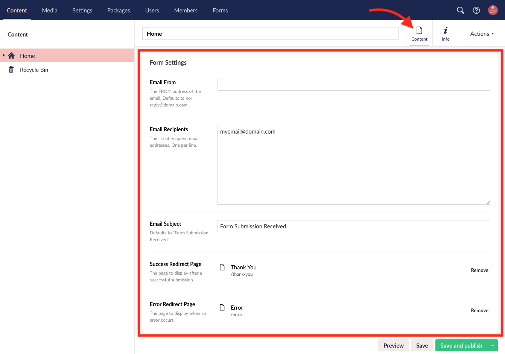

# Applying The Form Settings Doctype Composition

Before using the Form Handler macro, you will need to make sure that the content editor can setup the [form settings](How-It-Works.html#form-settings-explained) on a node within Umbraco.

**Please consult a developer for tips on best practice to implement this functionality prior to making these changes. This guide is for general setup instructions and implementation can vary per Umbraco site.**

If the form settings are not available on your doctype, you can apply the Form Settings doctype as a composition by navigating to the doctype in the Settings section, click on the Compositions button, tick the checkbox for Form Settings, click Submit and Save your changes.

Once you have your form settings composition applied to your doctype you will see the Form Settings area on your content node's Content App.

