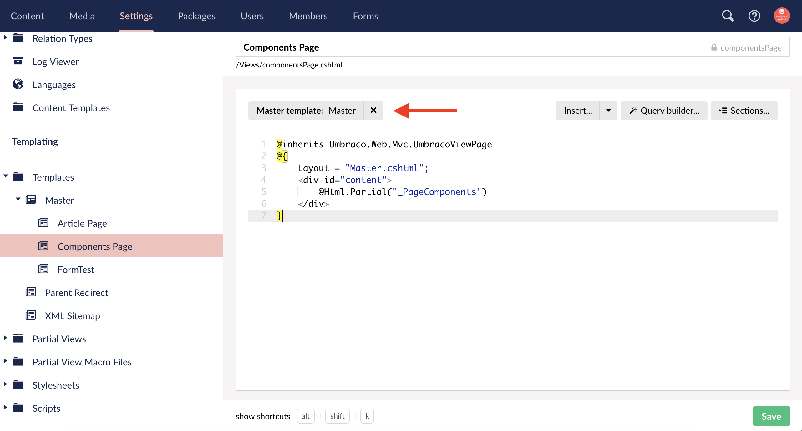

# DT Starterkit Package 

**Version {{ page.packageVersion }}**
**Compatible with Umbraco Version {{ page.versionFrom }}**

This package setup begins after the [Site Setup Checklist](/MyUmbDocs/site-setup/Site-Setup-Checklist.html#site-setup-checklist) has been completed.

The starterkit package assumes that the build out will follow the [page components method](#) of setting up a website and therefore includes the initial basic components for setting up the page components and installing the [grid layout page component](#).

The package includes meta data setup for basic SEO data, Open Graph data, and schema markup. There is an article page included assuming that the site will use a blog of some sort and need the schema markup implemented for that as well. The schema markup for the article is within the article template itself. The doctype with the basic properties setup is also included.

The partial view files included have pre-existing markup. The _Header.cshtml file includes header markup that has been slightly modified from Bootstrap v4 to have multiple styling options based on variables for arrows or hovering while remaining usable for keyboard only users.

The starterkit also includes the form handler package to handle form submissions.

## Setup Instructions

1. Install the DT Starterkit package via the Install Local option the Umbraco Packages section.
2. Configure Data Types
   - Configure rich text editor stylesheets and toolbar settings
   - Configure grid layout and rich text editor stylesheet and toolbar settings
3. Adjust template inheritance in settings section - This is because the files come into umbraco with the proper code but the tree structure doesnt appear to register that some templates are using the Master template for the master. 
   - 

