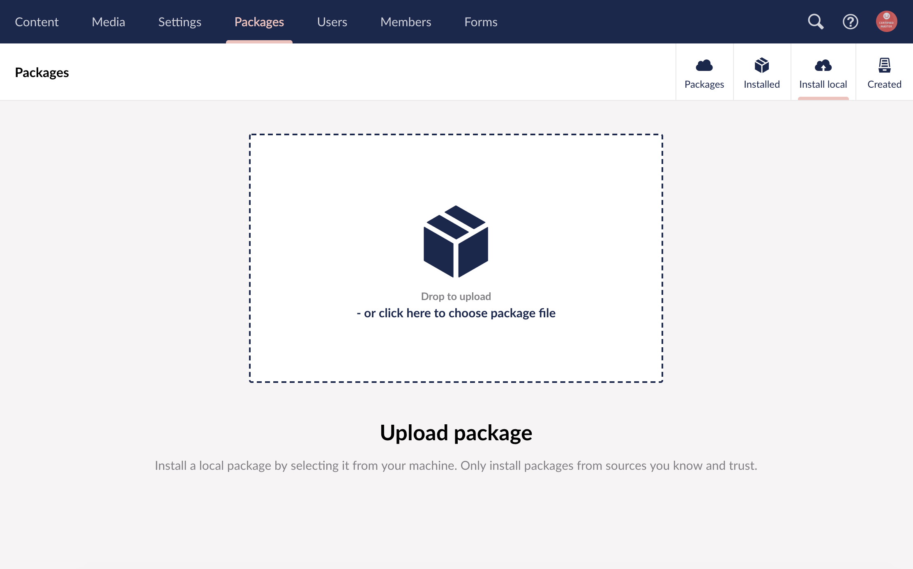
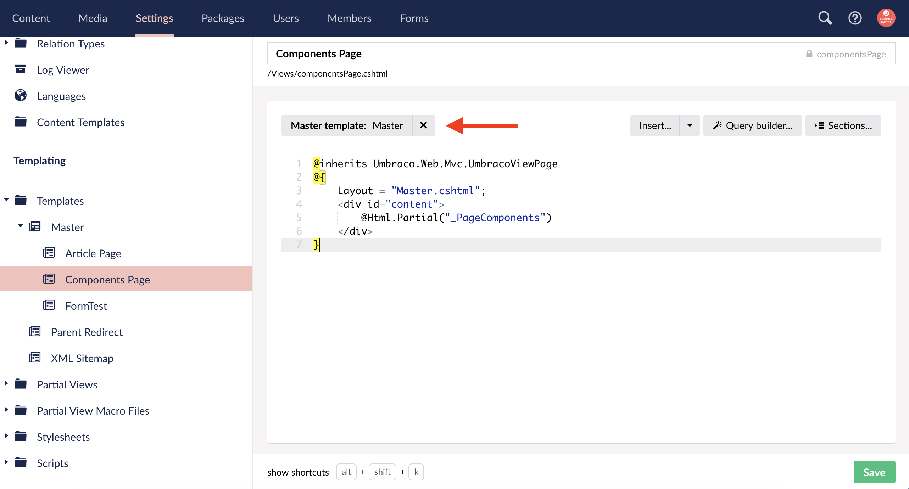

# DT Starterkit Package 

*Version {{ page.packageVersion }} Compatible with Umbraco {{ page.versionFrom }}+*

This package setup begins after the [Site Setup Checklist](site-setup/Site-Setup-Checklist.html#site-setup-checklist) has been completed.

## Package Includes

A full list of the Umbraco v{{ page.versionFrom }} Starterkit Package contents can be found on the [package includes](Starterkit-Package/v8/Package-Includes.html) page.

## v{{ page.versionFrom }} Setup Instructions

1. Install the DT Starterkit package via the Install Local option the Umbraco Packages section.
   - 
2. Configure the following Data Types
   - Richtext editor
     - Adjust toolbar options as needed
     - Assign user stylesheet
     - Turn off image resizing by setting 'Maximium size for inserted images' to 0 Pixels.
   - Grid Layout Richtext editor
     - Adjust toolbar options as needed
     - Assign user stylesheet
     - Turn off image resizing by setting 'Maximium size for inserted images' to 0 Pixels.
3. Adjust template inheritance in settings section - This is because the files come into umbraco with the proper code but the tree structure doesnt appear to register that some templates are using the Master template for the master. 
   - 

The rest of the starterkit setup starts with customzing your page components based off your design evaluation. 