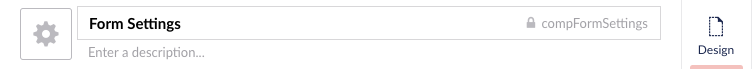
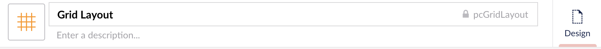

# Starterkit Package Includes
{: .no_toc }

*Version {{ page.packageVersion }} Compatible with Umbraco {{ page.versionFrom }}+*

Listed below are all the items included in the DT Starterkit Package.

## Table of Contents
{: .no_toc .text-delta }

1. TOC
{:toc}

## Templates

The below templates are included in the DT Starterkit Package. The list below reflects the master template structure it should be reflected in the Umbraco Templates folder.

- Master `~/Views/master.cshtml`
  - Components Page `~/Views/componentsPage.cshtml`
  - Article Page `~/Views/articlePage.cshtml`
- Parent Redirect `~/Views/parentRedirect.cshtml`
- XML Sitemap `~/Views/xMLSitemap.cshtml`

## Partial Views

- `~/Views/Partials/_MetaData.cshtml`
- `~/Views/Partials/_Header.cshtml`
- `~/Views/Partials/_Footer.cshtml`
- `~/Views/Partials/_PageComponents.cshtml`
- `~/Views/Partials/_PC_Switch.cshtml`
- `~/Views/Partials/PageComponents/_PC_GridLayout.cshtml`

## Macros

- Form Handler
  - Macro partial view: `~/Views/MacroPartials/FormHandler.cshtml`
  - Parameters: 
    1. Title: `Inherit From` Alias: `InheritFrom` Type: `Textarea`
- Form Email Master
  - Macro partial view: `~/Views/MacroPartials/FormEmailMaster.cshtml`
- Contact Form
  - Macro partial view: `~/Views/MacroPartials/ContactForm.cshtml`
- Contact Email Template
  - Macro partial view: `~/Views/MacroPartials/ContactEmailTemplate.cshtml`
- Contact User Email Template
  - Macro partial view: `~/Views/MacroPartials/ContactUserEmailTemplate.cshtml`

## Stylesheets

The stylesheets folder contains various stylesheets related to the indiviual project. The starterkit includes the following for getting started.

- `~/css/user.css`
  - The user stylesheet will need to be configured to be used by the rich text editor in Umbraco. It is typically an empty file that just imports the main css file to display some of the styling into the rich text editor within Umbraco.
- `~/css/bootstrap.css`
  - Unmodified vendor stylesheet is included in the starterkit.
- `~/css/fa-all.css`
  - Unmodified vendor stylesheet is included in the starterkit.
- `~/css/fonts/` [Directory]
  - This directory includes unmodified vendor font awesome webfont files.

## Scripts

The scripts folder contains various scripts related to the indiviual project. The starterkit includes the following for getting started.

- `~/scripts/scss/` [Directory]
  - In the scripts folder, there is a `/scss/` or `/less/` directory to store the files used to generate the website stylesheets with the preprocessor you want to use. Typically SASS is the preferred method. You will need to add your sass files in this directory. This makes it so that a backoffice user cannot modify the stylesheet directly from the Umbraco backoffice and forces this type of development to be done by a developer. 
- `~/scripts/main.js`
  - The main.js file is the default file for storing the javascript used by the site. This file would be customized based on what plugins and resources your site needs.

## DocumentTypes

- [Home](Doctype-Home-Schema.md)
- [Article Page](Doctype-Article-Page-Schema.md)
- [Components Page](Doctype-Comp-Page-Schema.md)
- [Page Components Folder](Doctype-Page-Comp-Folder-Schema.md)
- Page Components [Organizational Folder]
  - [Grid Layout](Doctype-Grid-Layout-Schema.md)
- Compositions [Organizational Folder]
  - [Form Settings](Doctype-Form-Settings-Schema.md)
  - [Page Settings](Doctype-Page-Settings-Schema.md)
  - [SEO](Doctype-SEO-Schema.md)
  - [Component Settings](Doctype-Comp-Settings-Schema.md)
- Content Only [Organizational Folder]
  - [Global Settings](Doctype-Global-Settings-Schema.md)
  - [Nested Address](Doctype-Nested-Address-Schema.md)

### Important Document Type Naming Conventions
{: .no_toc }

Default naming conventions for document types is the doctype name in camel case format. For example, `componentsPage`, `articlePage` and `home`.

Composition document types are prefixed with the word `comp` before the doctype name. For example, the Form Settings composition document type alias would be `compFormSettings`. The document type icon for composition doctypes is set to the black / default color and uses `icon-settings`. This makes it easy to spot in the lists of doctypes and you know that it is setup as a composition.

Page component document type aliases must be prefixed with the lowercase letters `pc` to denote that this document type is setup as a page component. Page component document type icons are also a different color than the black / default color. The starterkit uses the color orange to denote nodes without views / templates associated to them including the page components.

This practice makes it easy to recognize when selecting doctypes within Umbraco. It also helps users denote the difference in nodes when they see the document type icons and colors.

## DataTypes

- Starterkit [Organizational Folder]
  - Nested Address
  - Better Label
  - Image Picker
  - Navigation MNTP
  - Open Graph Image Cropper
  - Schema Markup Type
  - Simple Editor
  - Single Link
- Page Components [Organizational Folder]
  - Article Image Cropper
  - Grid Layout
- Component Settings [Organizational Folder]
  - Background Position Dropdown
  - Background Repeat Dropdown
  - Background Size Dropdown
  - Horizontal Alignment Dropdown
  - Size Dropdown
  - Text Markup Dropdown
  - Vertical Alignment Dropdown
  - Video Aspect Ratio Dropdown

## Custom Code

- `~/App_Code/PageComponents.cs`
  - PageComponents.cs needs to be updated during buildout with various document type aliases in order to auto generate the Page Components Folder child node type.
- `~/App_Plugins/BetterLabel/` [Directory]
  - This is a custom property type.
- `~/Robots.txt`