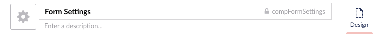
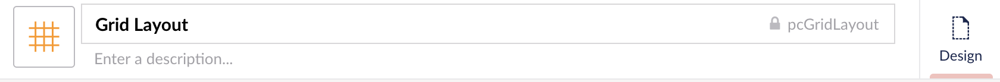

# Starterkit Document Types

- [Home](doctypes/Doctype-Home-Schema.html)
- [Article Page](doctypes/Doctype-Article-Page-Schema.html)
- [Components Page](doctypes/Doctype-Comp-Page-Schema.html)
- [Page Components Folder](doctypes/Doctype-Page-Comp-Folder-Schema.html)
- Page Components [Organizational Folder]
  - [Grid Layout](doctypes/Doctype-Grid-Layout-Schema.html)
- Compositions [Organizational Folder]
  - [Form Settings](doctypes/Doctype-Form-Settings-Schema.html)
  - [Page Settings](doctypes/Doctype-Page-Settings-Schema.html)
  - [SEO](doctypes/Doctype-SEO-Schema.html)
  - [Component Settings](doctypes/Doctype-Comp-Settings-Schema.html)
- Content Only [Organizational Folder]
  - [Global Settings](doctypes/Doctype-Global-Settings-Schema.html)
  - [Nested Address](doctypes/Doctype-Nested-Address-Schema.html)

## Important Document Type Naming Conventions
{: .no_toc }

Default naming conventions for document types is the doctype name in camel case format. For example, `componentsPage`, `articlePage` and `home`.

Composition document types are prefixed with the word `comp` before the doctype name. For example, the Form Settings composition document type alias would be `compFormSettings`. The document type icon for composition doctypes is set to the black / default color and uses `icon-settings`. This makes it easy to spot in the lists of doctypes and you know that it is setup as a composition.

Page component document type aliases must be prefixed with the lowercase letters `pc` to denote that this document type is setup as a page component. Page component document type icons are also a different color than the black / default color. The starterkit uses the color orange to denote nodes without views / templates associated to them including the page components.

This practice makes it easy to recognize when selecting doctypes within Umbraco. It also helps users denote the difference in nodes when they see the document type icons and colors.