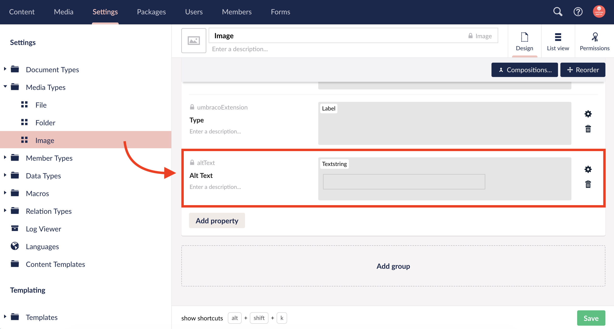
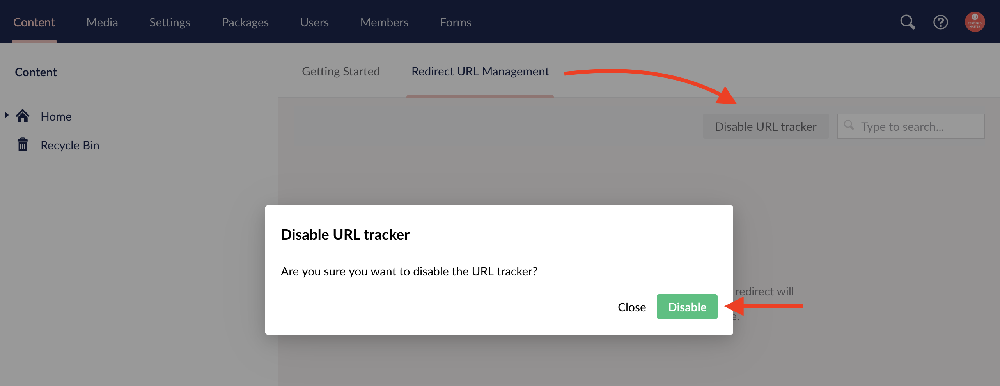

**Table of Contents**
1. TOC
{:toc}

# Site Setup Checklist

Once your Umbraco site is installed these are some general settings to configure on your site. Please note that this checklist assumes that you know your way around the Umbraco backoffice to perform basic configuration tasks such as modifing document types and user groups. Most updates here consist of file changes in the file system.

## Working Locally

If you are working locally with your site, using uSync or another package, check these items before proceeding.

- Configure git.ignore file before first commit
- Save Visual Studio .SLN file in root (configure build manager)

## Web.config Updates

- Turn on debug mode `debug="true"` in th web.config file. The default setting for this is `false`.
- Turn off custom errors `<customErrors mode="Off"/>`. The default setting for this is `RemoteOnly`.
- Turn on trace by updating the `enabled="true"` and `localOnly="false"`
  - The web.config line should look similar to this: `<trace enabled="true" requestLimit="10" pageOutput="false" traceMode="SortByTime" localOnly="false"/>`
- Configure mail server setting
  - For example: `<network host="websmtp.discovertec.net"/>`
- Configure 404 handler in `<system.webServer>` section `<httpErrors existingResponse="PassThrough"/>`
- Add custom properties *(optional)*
  - Umbraco time out period `<add key="UmbracoTimeOutPeriod" value="60"/>`
  - Umbraco version check period `<add key="UmbracoVersionCheckPeriod" value="0"/>`

## File Updates

These are optional suggestions and should be customized to meet your site needs.

- Add robots.txt file *(configure as needed)*
- Update `/config/grid.editors.config.js` *(configure as needed)*
  - Comment out Embed
  - Comment out Headline
- Update `/config/tinyMceConfig.config` *(configure as needed)*
  - The [.txt file included](https://github.com/bkclerke/myumbdocs/blob/master/site-setup/files/Config/tinyMceConfig.config.txt) contains the snippet `<config key="style_formats">` that includes some basic formatting options. These options can be configured as needed to create more specific selectors in the rich text editor.
- Update `/config/umbracoSettings.config` to remove the trailing slashes for links
  - Set `<addTrailingSlash>false</addTrailingSlash>` in the `<requestHandler>` section
- Update grid editor views `/views/partials/grid/editors/` (*configure as needed*)
  - Update `media.cshtml` with bootstrap resonsive image class
    - example: bootstrap v4 would require the `class="img-fluid"` added to the image
    - Verify that alt text is applied to the image

## Umbraco Backoffice Setup

- Add `altText` textstring property to the Media DocType in the Settings section.
  - 
  - This is used when dynamically generating images on pages. For example, in macros that are custom built for the site we would default to use this for specifing alt text for the image. Alt text will still need to be manually adjusted via the rich text editor and by content editors where applicable.
- Turn off the Redirect URL Management console in the backoffice. This is not needed when developing a site. This can be turned on when the site is pushed live if required.
  - The Redirect URL Management console is located in the main Content section next to Getting Started.
  - 

### Umbraco Users Setup

- Delete the extra groups not needed including but not limited to:
  - Writers
  - Editors
  - Sensitive Data
- Create Marketing group
  - Allow access to Content and Media section
  - Give permissions for all tasks except "change node type" and options related to translation as these are not needed.

# Site Completion Checklist

Things to check once development is completed and before launching an Umbraco site.

- Setup 404 Error Page
  - The web.config updates included the line needed to allow the custom 404 pages to show up.
  - Modify the `/config/umbracoSettings.config` `<errors>` section.
  - Once a page is setup in Umbraco for the 404 error page. Use the ID of that page and place it in the `<error404></error404>` tag.
-  Turn off debug mode by setting `debug="false"` in the web.config
-  Turn off trace by setting `enabled="false"` and `localOnly="true"` in the `<trace>` line in the web.config
-  Set `<customErrors="RemoteOnly">` to complete turning off error messages.
-  Check that the mail server is correctly configured.
-  Enable the Redirect URL Management console in the Umbraco backoffice.